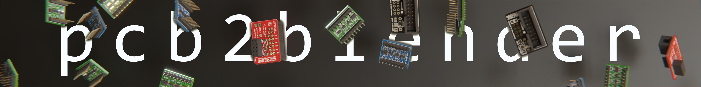
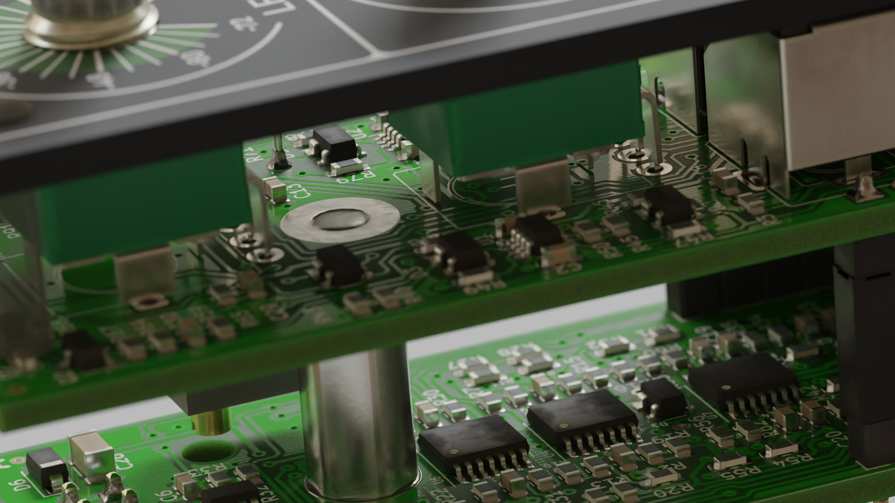

The pcb2blender workflow lets you create professionally looking product renders of all your
KiCad projects in minutes! Simply export your board as a `.pcb3d` file in KiCad, import it into
Blender and start creating!

It lets you focus all your time on actually composing and lighting an interesting scene,
skipping all the boring cleanup work that would be required without it.

Its quick export/import times also make it viable to create renders of WIP boards or to update
them, after last minute board revisions.

## Usage

1. Hit the `Export to Blender (.pcb3d)` button in pcbnew.
2. Import the file in Blender via `File -> Import -> PCB (.pcb3d)`
3. Start creating awesome renders!

### Features

### Advanced Features

## Installation

### Exporter (KiCad)

- (not available yet) via the builtin plugin manager 
  `Tools -> Plugin and Content Manager -> Plugins -> pcb2blender`

- (manual) Download the `pcb2blender_exporter.zip` from the
  [latest release](https://github.com/30350n/pcb2blender/releases/latest),
  unpack the `plugins` directory from it into your
  [Kicad Plugin directory](https://dev-docs.kicad.org/en/python/pcbnew/) and rename it to
  `pcb2blender_exporter`.

### Importer (Blender)

- (manual) Download the `pcb2blender_importer.zip` from the
  [latest release](https://github.com/30350n/pcb2blender/releases/latest),
  install it in Blender via 
  `Edit -> Preferences -> Add-ons -> Install` 
  (you need to install the actual zip file, don't unpack it!)
  and enable it (enabling the addon for the first time will take a few minutes).
  
### Note on python version (Linux and macOS)

On Windows, KiCad and Blender both ship with their own bundled python version
(python 3.9 for KiCad 6.0 and python 3.10 for Blender 3.2). On Linux/macOS, depending on the
exact flavor and packaging/installation method used, either software might just use your
systems python version directly. If you run into any issues, make sure you're running
python 3.10, first.

## Other Projects

- The [protorack-kicad](https://github.com/30350n/protorack-kicad) KiCad library, contains
  all the custom symbols and footprints I use for eurorack module development.

- The [svg2blender](https://github.com/30350n/svg2blender) workflow enables you to export
  2D graphical designs from [Inkscape](https://inkscape.org/) to Blender. It's mainly intended
  for use with front panel designs, but could be used for other things as well.

## Credits

- The name of this project is inspired by the awesome
  [svg2shenzhen](https://github.com/badgeek/svg2shenzhen) Inkscape extension by
  [badgeek](https://github.com/badgeek).

- The PCB Shader node setup this addon comes with is inspired by the
  [stylized-blender-setup](https://github.com/PCB-Arts/stylized-blender-setup)
  repository by [PCB-Arts](https://www.pcb-arts.com).

## License

- This project is licensed under
  [GPLv3](https://github.com/30350n/pcb2blender/blob/master/LICENSE).
